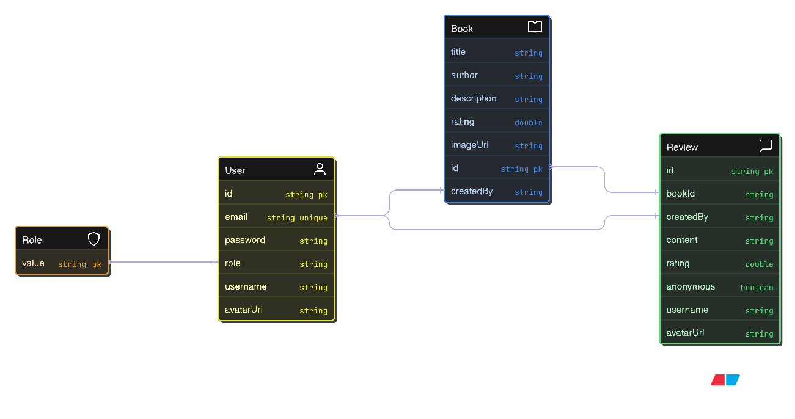

# BookReviewHub

BookReviewHub is a full‑stack web application for browsing books and sharing reviews.
The **backend** is built with Spring Boot, while the **frontend** uses React + Vite + Tailwind CSS.

## Features

- User registration & authentication
- Browse, search, and filter the book catalogue
- Write, edit, and delete reviews (anonymous or attributed)
- Personal profile with display name and avatar
- Admin dashboard to manage books and moderate reviews

## Getting Started

### Prerequisites

| Tool    | Version |
| ------- | ------- |
| Node.js | 18 +    |
| Java    | 17 +    |
| Maven   | 3.9 +   |

> **Tip:** the repo contains no compiled artefacts; all commands below run from source.

### Installation & Run (local dev)

```bash
# clone once
git clone https://github.com/<your‑org>/BookReviewHub.git
cd BookReviewHub

# 1 – install front‑end deps
cd frontend
npm install

# 2 – start both servers in parallel (root script)
cd ..
npm run dev
```

The script starts:

- React dev‑server at **[http://localhost:5173](http://localhost:5173)**
- Spring Boot API at **[http://localhost:8080](http://localhost:8080)**

> Prefer separate terminals? Start each half with:
>
> ```bash
> # backend only
> cd backend
> mvn spring-boot:run
>
> # front‑end only
> cd frontend
> npm run dev
> ```

## Configuration

Create **`.env`** files in both sub‑projects (they’re ignored by Git).
Use _placeholder_ values; insert your real secrets locally.

```dotenv
# backend/.env
JWT_SECRET=<your‑jwt‑secret>              # any random 256‑bit base64 string
JWT_EXPIRATION_MS=3600000                # 1 hour
FIREBASE_KEY_PATH=classpath:firebase/serviceAccountKey.json

# frontend/.env
VITE_API_BASE_URL=http://localhost:8080
```

| Variable              | Purpose                                                                    |
| --------------------- | -------------------------------------------------------------------------- |
| **JWT_SECRET**        | HMAC key used to sign access tokens. Generate once and keep private.       |
| **JWT_EXPIRATION_MS** | Lifetime of a token in milliseconds.                                       |
| **FIREBASE_KEY_PATH** | Location of the Firebase service‑account JSON. Default works in local dev. |
| **VITE_API_BASE_URL** | Base URL the browser calls for the API.                                    |

---

### Sample Data (optional)

Populate the Firestore database with curated books and random reviews:

```bash
# books
mvn -q spring-boot:run -Dspring-boot.run.arguments="--seed=books"

# reviews (run after books)
mvn -q spring-boot:run -Dspring-boot.run.arguments="--seed=reviews"
```

Leave the process running (Tomcat keeps it alive) or press **Ctrl‑C** after the
"Seeded …" message.


## Screenshots

| Page                   | Preview                                                                |
| ---------------------- | ---------------------------------------------------------------------- |
| **Signup**             |                        |
| **Login**              |                          |
| **Home**               |                            |
| **Book&nbsp;details**  |          |
| **Admin – Books list** |               |
| **Admin – Add book**   |         |
| **Admin – Edit book**  |  |
| **Admin – Reviews**    |                 |
| **Profile**            |                      |


## Entity‑Relationship Diagram (ERD)



| Entity     | Key fields                                                                          | Relationships                    |
| ---------- | ----------------------------------------------------------------------------------- | -------------------------------- |
| **User**   | `id`, `email`, `password`, `role`, `username`, `avatarUrl`                          | 1 ‒‣ ∞ **Review** (author)       |
| **Book**   | `id`, `title`, `author`, `description`, `rating`, `imageUrl`, `createdBy`           | 1 ‒‣ ∞ **Review** (subject)      |
| **Review** | `id`, `bookId`, `userId`, `content`, `rating`, `anonymous`, `username`, `avatarUrl` | ∞ ‒ 1 **User**<br>∞ ‒ 1 **Book** |

Cardinality:

- A **User** can author many reviews, but each review is written by exactly one user.
- A **Book** can receive many reviews, but each review belongs to exactly one book.
- Deleting a book cascades and deletes its reviews; deleting a user anonymises their past reviews.

## Pseudocode (rating refresh)

```plaintext
WHEN a review is created, updated, or deleted
    FETCH the target book by its ID
    RECOMPUTE   avgRating = average(of all review.rating where bookId = ID)
    UPDATE      book.rating = avgRating
END WHEN
```

The back‑end triggers this logic inside `ReviewService.refreshRating()` every time a review mutates.

## User Stories

| ID  | Story                                                                                                                                         |
| --- | --------------------------------------------------------------------------------------------------------------------------------------------- |
| US1 | As a visitor, I can **sign up with email & password** so I can access protected features.                                                     |
| US2 | As a newly registered user **without a display name**, I’m redirected to the **profile page** to add or edit my username and optional avatar. |
| US3 | As a reader, I can **browse and search** the book catalogue and view aggregate ratings.                                                       |
| US4 | As a logged‑in user, I can **write, edit, or delete reviews**, posting them anonymously or under my profile.                                  |
| US5 | As an admin, I can **add, update, or delete books** and **moderate reviews** from a dashboard.                                                |
